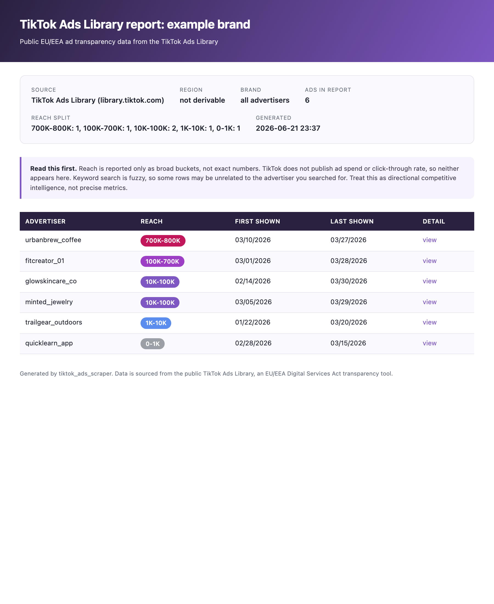

# TikTok Ads Scraper

A small, standalone Python and Playwright tool that scrapes the public TikTok
Ads Library and turns the results into a clean PDF report. It runs on its own
from the command line, and it also ships with Claude Code skills and a one-step
installer.



## Important: what this data is (and is not)

The TikTok Ads Library is a transparency tool that exists because of the EU
Digital Services Act (DSA). Keep these limits in mind before you rely on it:

- It covers EU and EEA regions only. There is no global data.
- It holds nothing from before October 2022.
- It does not contain ad spend, and it does not contain click-through rate.
- Reach is shown only as broad buckets (for example "10K-100K"), never exact
  numbers.
- Keyword search is fuzzy, so a brand search can return some unrelated ads.

Treat the output as directional competitive intelligence, not precise metrics.

## Features

- Scrape a brand's ads by keyword, region, and look-back window. The brand is
  auto-resolved to its advertiser id.
- Rank ads with a deterministic, longevity-weighted "winner score" and keep the
  top N.
- Optionally download the winner videos and extract keyframes (plus transcripts
  when the optional `faster-whisper` dependency is installed) for creative
  analysis.
- Generate a styled, professional A4 PDF report from any scraped CSV, complete
  with reach badges, clickable detail links, and an honest caveats note.
- Headless by default, with a `--headful` flag when you want to watch.

## Quick start

Clone the repository:

```bash
git clone https://github.com/Chris-1994/tiktok_ads_scraper.git
cd tiktok_ads_scraper
```

### Set up with Claude (recommended)

Open Claude Code in the folder and paste this:

> Set up this project: run `./install.sh`, then run the tests to confirm it
> works, and show me 2–3 example commands plus how to use the `tiktok-ad-report`
> skill.

Claude reads the bundled `CLAUDE.md`, runs the installer (virtual environment,
dependencies, chromium, and the two skills), and gets you to a working setup.

### Or install it yourself

```bash
./install.sh
```

The installer creates a virtual environment, installs the dependencies, downloads
chromium for Playwright, and installs the bundled Claude Code skills.

Prefer fully manual steps? Run these instead:

```bash
python3 -m venv .venv
source .venv/bin/activate
pip install -r requirements.txt
python -m playwright install chromium
```

## Usage

Activate the environment first (`source .venv/bin/activate`), then:

### Scrape and rank a brand

```bash
python scraper.py --brand gymshark --region GB --days 30 --top 20
```

This scrapes the brand's ads, ranks them by a longevity-weighted winner score,
and writes `output/gymshark/ads.csv` (all ads) and `output/gymshark/winners.csv`
(the top 20).

### Download and process the winner videos

```bash
python scraper.py --brand gymshark --region GB --top 20 --download
```

Adds `output/gymshark/videos/<ad_id>.mp4`, keyframes under
`output/gymshark/frames/<ad_id>/`, and transcripts under
`output/gymshark/transcripts/`. Downloading needs `ffmpeg` on your PATH;
transcripts also need the optional `faster-whisper` dependency.

### Resolve a brand id only

```bash
python scraper.py --resolve --brand gymshark --region GB
```

### Flags

| Flag         | Default | Meaning                                                   |
| ------------ | ------- | --------------------------------------------------------- |
| `--brand`    | (all)   | Brand keyword to target. Omit to scrape all advertisers.  |
| `--region`   | `GB`    | ISO country code, EU/EEA only (GB, FR, DE, AT, and more). |
| `--days`     | `30`    | Look-back window in days.                                 |
| `--limit`    | `100`   | Scrape pool size collected before ranking.                |
| `--top`      | `20`    | How many ranked winners to keep.                          |
| `--download` | off     | Download and process the winner videos.                   |
| `--resolve`  | off     | Resolve the brand id, print it, and exit.                 |
| `--headful`  | off     | Show the browser window instead of running headless.      |

### Build a PDF report

```bash
python report.py --csv output/gymshark/winners.csv
python report.py --csv output/gymshark/winners.csv --title "Gymshark on TikTok"
```

The PDF lands next to the CSV by default. Try it against the bundled sample:

```bash
python report.py --csv examples/sample_ads.csv --out output/sample_report.pdf
```

## Claude Code skills

The repository bundles two Claude Code skills, both copied into your
`~/.claude/skills/` folder when `install.sh` runs:

- **`tiktok-ad-report`** — scrape a brand and build a PDF report. Just ask Claude
  Code to research a brand's TikTok ads and it walks through the steps for you.
- **`tiktok-ad-brief`** — after a `--download` run, analyze the winning videos
  (frames + transcripts) and write a `brief.md` (plus a styled `brief.pdf`) of
  creative patterns and ready-to-shoot ad concepts.

The skills live in `skills/`.

## Output

Each run writes to `output/<brand>/`:

- `ads.csv` — every ad found, ranked, with a `winner_score` column.
- `winners.csv` — the top `--top` ads with richer detail fields
  (`caption_text`, `active_for_days`, `objective`, `paid_for_by`, `video_url`,
  `mentions_brand`).
- With `--download`: `videos/<ad_id>.mp4`, `frames/<ad_id>/*.jpg`, and
  `transcripts/<ad_id>.txt`.
- PDF reports are written next to their CSV with a `.pdf` extension.

The `output/` folder is git-ignored except for a `.gitkeep` placeholder, so your
scraped data and downloaded videos stay local.

## Run in Docker (optional)

A Dockerfile is included for full isolation from your host machine. It builds on
the official Playwright Python image, so chromium is already present:

```bash
docker build -t tiktok-ads-scraper .
docker run --rm -v "$PWD/output:/app/output" tiktok-ads-scraper \
  --brand gymshark --region GB --top 20
```

## Use responsibly

This tool reads public transparency data that TikTok itself publishes for the
EU and EEA. Please respect TikTok's Terms of Service, scrape gently (modest
limits, reasonable pauses), and use the data for legitimate research and
competitive analysis. You are responsible for how you use what you collect.

## License

MIT. See [LICENSE](LICENSE).
